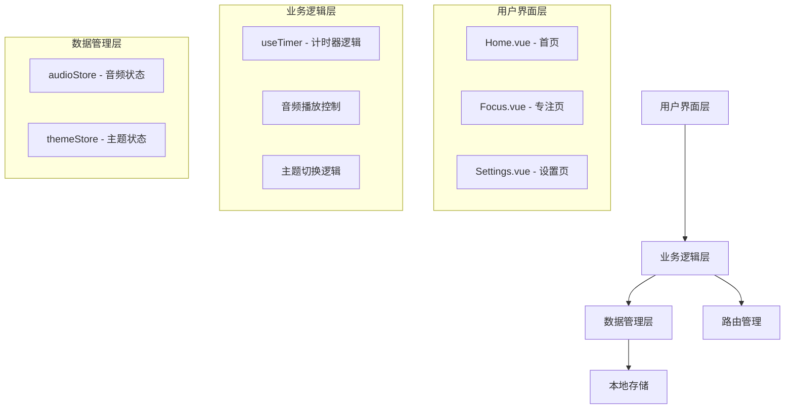
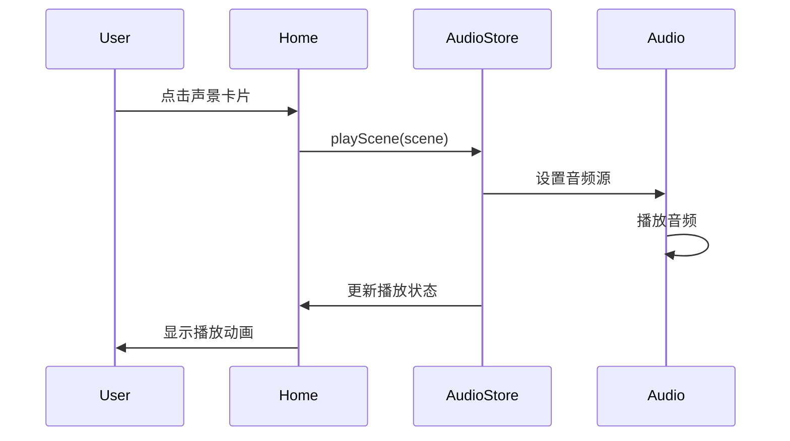
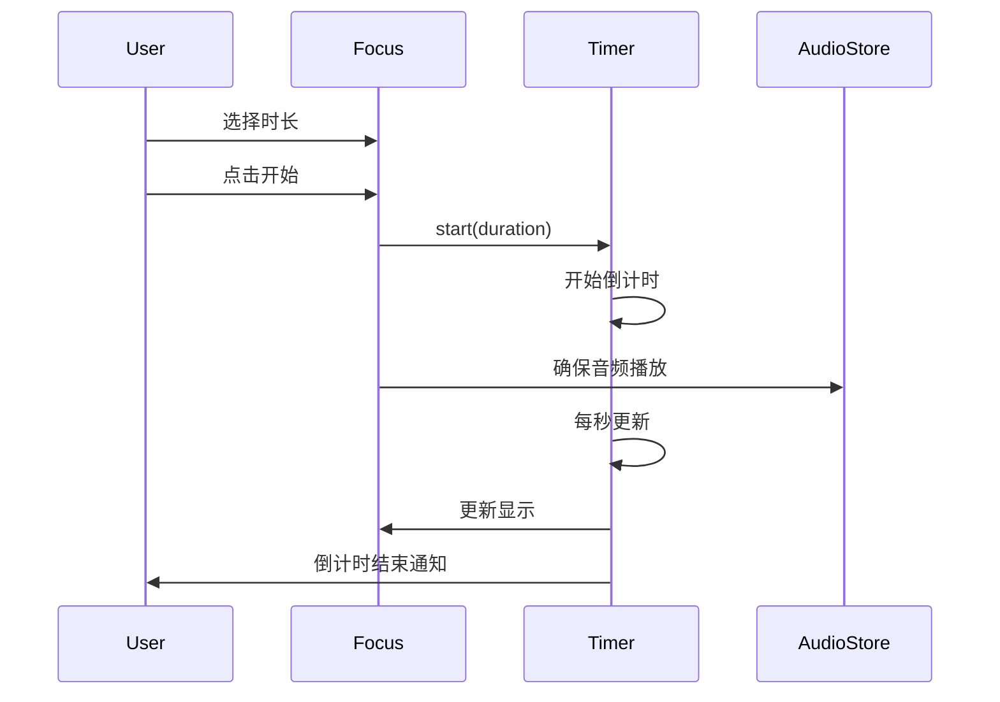

# 静谧空间 (ZenZone) - 设计报告

## 一、系统架构设计

### 1.1 整体架构



### 1.2 技术栈

| 技术 | 版本 | 用途 |
|------|------|------|
| Vue | 3.x | 前端框架 |
| TypeScript | 5.x | 类型系统 |
| Vite | 7.x | 构建工具 |
| Vant | 4.x | UI 组件库 |
| Pinia | 2.x | 状态管理 |
| Vue Router | 4.x | 路由管理 |

### 1.3 项目结构

```
zenzone/
├── public/                 # 静态资源
│   ├── audio/             # 音频文件
│   │   ├── rain.mp3
│   │   ├── forest.mp3
│   │   ├── fire.mp3
│   │   ├── ocean.mp3
│   │   ├── cafe.mp3
│   │   └── whitenoise.mp3
│   └── images/            # 图片资源
│       ├── rain.jpg
│       ├── forest.jpg
│       ├── fire.jpg
│       ├── ocean.jpg
│       ├── cafe.jpg
│       ├── whitenoise.jpg
│       └── default.jpg
├── src/
│   ├── views/             # 页面组件
│   │   ├── Home.vue       # 首页 - 声景选择
│   │   ├── Focus.vue      # 专注页 - 番茄钟
│   │   └── Settings.vue   # 设置页
│   ├── stores/            # 状态管理
│   │   ├── audio.ts       # 音频状态
│   │   └── theme.ts       # 主题状态
│   ├── composables/       # 组合式函数
│   │   └── useTimer.ts    # 计时器逻辑
│   ├── router/            # 路由配置
│   │   └── index.ts
│   ├── styles/            # 全局样式
│   │   └── variables.css  # CSS 变量
│   ├── App.vue            # 根组件
│   └── main.ts            # 入口文件
├── 需求分析.md
├── 设计报告.md
└── README.md
```

## 二、UI/UX 设计

### 2.1 设计理念

**核心设计原则：简洁、沉浸、舒适**

1. **简洁性**：界面简洁明了，操作直观易懂
2. **沉浸感**：全屏背景图片，营造沉浸式体验
3. **舒适性**：柔和的配色，护眼的深色模式

### 2.2 色彩系统

#### 日间模式
- **主色调**：渐变紫色 (#667eea → #764ba2)
- **背景色**：纯白 (#ffffff)
- **文字色**：深灰 (#2c3e50)
- **辅助色**：浅灰 (#f8f9fa)

#### 深色模式
- **主色调**：渐变紫色（保持一致）
- **背景色**：深蓝黑 (#1a1a2e)
- **文字色**：浅灰白 (#eaeaea)
- **辅助色**：深蓝 (#16213e)

### 2.3 页面设计

#### 2.3.1 首页 - 声景选择

**设计特点：**
- 全屏背景图片，随选中场景动态切换
- 2x3 宫格布局展示声景卡片
- 毛玻璃效果（Glassmorphism）卡片设计
- 底部固定播放控制栏

**交互设计：**
- 点击卡片：播放/暂停对应声景
- 背景切换：0.6s 淡入淡出过渡
- 播放指示：旋转的加载动画
- 触摸反馈：按下时缩放效果

#### 2.3.2 专注页 - 番茄钟

**设计特点：**
- 大尺寸圆形倒计时器（280x280px）
- SVG 绘制进度环，渐变色填充
- 清晰的时间显示（48px 字体）
- 时长选择按钮组

**交互设计：**
- 进度环：平滑的动画过渡
- 按钮状态：开始/暂停/继续/重置
- 声景联动：显示当前播放的声景
- 完成提示：通知 + 提示音

#### 2.3.3 设置页 - 个人中心

**设计特点：**
- 卡片式布局，分组清晰
- 音量滑块：实时预览
- 主题开关：即时切换
- 折叠面板：使用说明

**交互设计：**
- 滑块拖动：实时调节音量
- 开关切换：平滑的主题过渡
- 团队展示：圆形头像 + 渐变背景

## 三、核心功能实现

### 3.1 音频播放管理

**技术方案：**
```typescript
const audio = new Audio()
audio.loop = true  // 循环播放
audio.volume = 0.7 // 默认音量


interface SoundScene {
  id: string
  name: string
  icon: string
  audioUrl: string
  bgImage: string
  description: string
}
```

**关键功能：**
1. 场景切换：切换音频源并播放
2. 音量控制：实时调节音量（0-1）
3. 播放状态：播放/暂停/停止
4. 持久化：保存音量设置到 localStorage

### 3.2 番茄钟计时器

**技术方案：**
```typescript
// 使用 setInterval 实现倒计时
const intervalId = setInterval(() => {
  if (remainingSeconds > 0) {
    remainingSeconds--
  } else {
    complete()  // 完成回调
  }
}, 1000)
```

**关键功能：**
1. 倒计时逻辑：每秒递减
2. 进度计算：(total - remaining) / total * 100
3. 时间格式化：MM:SS 格式显示
4. 完成通知：Web Notifications API

### 3.3 主题切换

**技术方案：**
```typescript
// CSS 变量 + data-theme 属性
document.documentElement.setAttribute('data-theme', 'dark')

// CSS
[data-theme='dark'] {
  --bg-primary: #1a1a2e;
  --text-primary: #eaeaea;
}
```

**关键功能：**
1. 主题检测：检测系统主题偏好
2. 主题切换：切换 data-theme 属性
3. 持久化：保存到 localStorage
4. 平滑过渡：CSS transition 动画

### 3.4 状态管理

**Pinia Store 设计：**

```typescript
// audioStore - 音频状态
{
  currentScene: SoundScene | null,
  isPlaying: boolean,
  volume: number,
  playScene(scene),
  pause(),
  resume(),
  stop()
}

// themeStore - 主题状态
{
  mode: 'light' | 'dark',
  applyTheme(theme),
  toggleTheme(),
  initTheme()
}
```

## 四、数据流设计

### 4.1 音频播放流程



### 4.2 番茄钟流程



## 五、性能优化

### 5.1 资源优化
- **图片压缩**：背景图片压缩至 < 500KB
- **音频优化**：MP3 格式，128kbps 码率
- **懒加载**：路由组件懒加载
- **代码分割**：Vite 自动代码分割

### 5.2 渲染优化
- **虚拟滚动**：声景列表使用虚拟滚动（如需扩展）
- **防抖节流**：音量滑块使用防抖
- **CSS 动画**：使用 transform 和 opacity
- **避免重排**：使用 CSS 变量

### 5.3 加载优化
- **预加载**：首页背景图片预加载
- **缓存策略**：静态资源浏览器缓存
- **CDN 加速**：部署到 CDN（可选）

## 六、兼容性处理

### 6.1 浏览器兼容
- **音频格式**：MP3（兼容性最好）
- **CSS 特性**：使用 autoprefixer
- **JavaScript**：ES6+ 语法，Vite 自动转译
- **通知 API**：优雅降级，不支持则跳过

### 6.2 移动端适配
- **视口设置**：`<meta name="viewport" content="width=device-width, initial-scale=1.0">`
- **触摸优化**：使用 touch 事件
- **字体大小**：使用 rem 单位
- **布局方案**：Flexbox + Grid

## 七、安全性设计

### 7.1 数据安全
- **本地存储**：仅存储非敏感数据（音量、主题）
- **XSS 防护**：Vue 自动转义
- **HTTPS**：部署时使用 HTTPS

### 7.2 隐私保护
- **无用户追踪**：不收集用户数据
- **无第三方服务**：不集成第三方分析
- **离线可用**：支持离线使用（PWA 扩展）

## 八、测试方案

### 8.1 功能测试
- [ ] 声景播放/暂停
- [ ] 背景图片切换
- [ ] 音量调节
- [ ] 倒计时准确性
- [ ] 主题切换
- [ ] 路由导航

### 8.2 兼容性测试
- [ ] iOS Safari 测试
- [ ] Android Chrome 测试
- [ ] 微信浏览器测试
- [ ] 不同屏幕尺寸测试

### 8.3 性能测试
- [ ] 页面加载时间
- [ ] 音频播放流畅度
- [ ] 内存占用
- [ ] CPU 占用

## 九、部署方案

### 9.1 构建配置
```bash
# 生产环境构建
npm run build

# 构建产物
dist/
├── index.html
├── assets/
│   ├── index-[hash].js
│   └── index-[hash].css
├── audio/
└── images/
```

### 9.2 部署平台
- **GitHub Pages**：
- **Vercel**：
- **Netlify**：

## 十、维护与扩展

### 10.1 代码维护
- **代码规范**：ESLint + Prettier
- **类型检查**：TypeScript 严格模式
- **版本控制**：Git + GitHub/Gitee
- **文档更新**：及时更新文档

### 10.2 功能扩展
- **短期**：添加更多声景、自定义时长
- **中期**：专注统计、数据可视化
- **长期**：PWA 支持、原生应用

## 十一、总结

静谧空间（ZenZone）采用现代化的前端技术栈，以 Vue 3 + Vant UI 为核心，实现了一个功能完善、体验优良的移动端专注/助眠应用。通过合理的架构设计、优雅的 UI/UX 设计和高效的性能优化，为用户提供了一个简洁、沉浸、舒适的使用体验。

项目代码结构清晰，易于维护和扩展，为后续功能迭代奠定了良好的基础。
